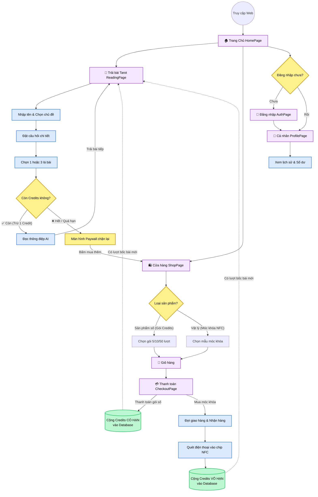

# Sơ Đồ Luồng Đi (User Flow) - CHIPSTAROT

Sơ đồ dưới đây thể hiện toàn bộ vòng lặp trải nghiệm người dùng, từ lúc truy cập trang web, sử dụng các dịch vụ Tarot cốt lõi, đối mặt với Paywall (khi hết lượt), cho đến hành trình mua sắm để nạp năng lượng (thông qua nạp số hoặc quét NFC vật lý).

